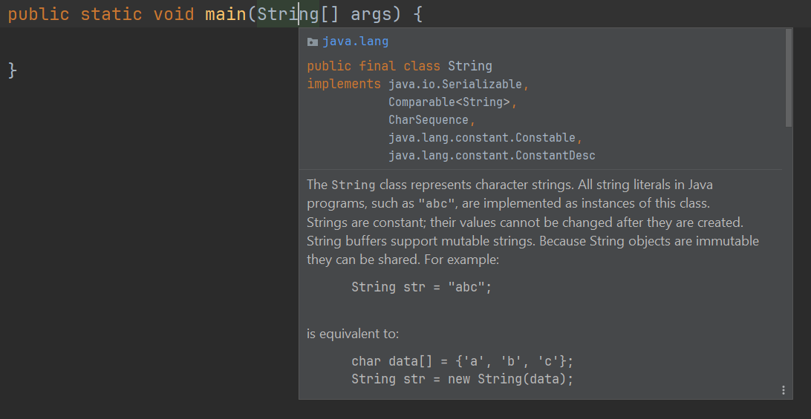
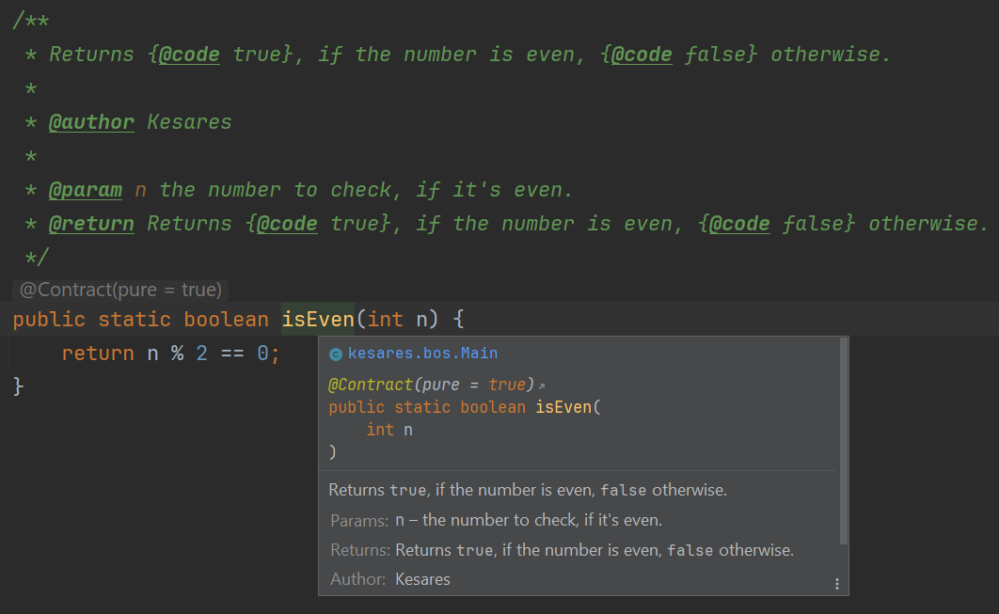

# 01 Java Token

## Einleitung
Die deutsche Sprache besteht aus Sätzen, welche sich wiederum aus bestimmten Worten und Wortreihenfolgen zusammensetzen. Dies wird als Grammatik bezeichnet. Auch Java (so wie jede andere Programmiersprache) besitzt solch eine Grammatik. Diese wird als Syntax bezeichnet. Der [Compiler](../resources/glossary.md#compiler) zerlegt diese Syntax oder auch Codezeilen in seine Bestandteile und identifiziert diese als Token. Diese Token sind die kleinsten Elemente eines Java-Programms.

## Token-Arten
Unterschieden wird zwischen 6 Token-Arten.

- [Bezeichner](#bezeichner)
- [Schlüsselwörter](#keywords)
- [Literale](#literale)
- [Operatoren](#operatoren)
- [Separatoren](#separatoren)
- [Kommentare](#kommentare)

### Bezeichner
Ein Bezeichner (eng. Identifier) ist im Prinzip ein frei wählbarer Name. Dieser wird unter anderem an Variablen, Funktionen, Klassen, etc. vergeben und zu einem späteren Zeitpunkt kann ein Konstrukt mit diesem Bezeichner angesprochen werden.

#### Namensregeln
Java setzt strikte Regeln, welche Zeichen an welcher Stelle für Bezeichner erlaubt sind.

- Variablen, Konstanten, Methoden und Klassen dürfen *nicht* mit einer Zahl \[0-9] anfangen.
- Variablen, Konstanten, Methoden und Klassen dürfen *keine* [Operatoren](#operatoren) oder [Separatoren](#separatoren) enthalten.

#### Namenskonventionen
Konventionen sind keine Regeln. Konventionen _können_, sollten aber nicht gebrochen werden.

- Es sollten keine Schlüsselwörter und auch nicht in abgewandelter Form verwendet werden (Ausnahme hier z.B. `class` → clazz)
- Es sollten keine Umlaute [Ä, ä, Ö, ö, Ü, ü, ß] verwendet werden.
- Es sollten keine Dollarzeichen `$` verwendet werden.
- Es sollten keine Unterstriche `_` verwendet werden (Ausnahme: Konstanten).
- Dollarzeichen `$` und Unterstriche `_` sollten am Anfang nur aus gutem Grund verwendet werden.
- Variablen und Methoden sollten nach der [CamelCase-Notation](../resources/glossary.md#camel-case-notation) benannt werden.
- Klassen (und damit auch Konstruktoren) sollten nach der [PascalCase-Notation](../resources/glossary.md#pascal-case-notation) benannt werden.

> [!NOTE]
> Weitere Konventionen werden in den jeweiligen Kapiteln beschrieben.

### Keywords
Schlüsselwörter (eng. Keywords) können nicht als [Bezeichner](#bezeichner) verwendet werden und sollten auch nicht als abgewandelte Form davon dienen. Sie dienen dem [Compiler](../resources/glossary.md#compiler) dazu u.a. Variablen, Schleifen oder Klassen zu identifizieren.

| Schlüsselwort | Anwendungsbereich                                                                    | Beschreibung                                                                                                                                                                                                                                                                                       |
|---------------|--------------------------------------------------------------------------------------|----------------------------------------------------------------------------------------------------------------------------------------------------------------------------------------------------------------------------------------------------------------------------------------------------|
| `assert`      | - Zusicherungen                                                                      | - Stellt Annahmen über den Zustand des Programms sicher.<br/>- Müssen erst aktiviert werden, um verwendet werden zu können.                                                                                                                                                                        |
| `boolean`     | - Variablen<br/>- Konstanten<br/>- Methoden (Rückgabetyp)<br/>- Methoden (Parameter) | - Primitiver Datentyp<br/>- Datentyp einer Variablen<br/>- Datentyp einer Konstante<br/>- Rückgabetyp einer Methode                                                                                                                                                                                |
|               |                                                                                      |                                                                                                                                                                                                                                                                                                    |
| `break`       | - Schleifen<br/>- `switch`-`case`-Ausdrücke                                          | - Beendet die Ausführung einer Schleife.<br/>- Verhindert das "Durchfallen" in einem `switch`-`case`-Ausdruck.                                                                                                                                                                                     |
| `byte`        | - Variablen<br/>- Konstanten<br/>- Methoden (Rückgabetyp)<br/>- Methoden (Parameter) | - Primitiver Datentyp<br/>- Datentyp einer Variablen<br/>- Datentyp einer Konstante<br/>- Rückgabetyp einer Methode                                                                                                                                                                                |
| `catch`       |                                                                                      |                                                                                                                                                                                                                                                                                                    |
| `char`        | - Variablen<br/>- Konstanten<br/>- Methoden (Rückgabetyp)<br/>- Methoden (Parameter) | - Primitiver Datentyp<br/>- Datentyp einer Variablen<br/>- Datentyp einer Konstante<br/>- Rückgabetyp einer Methode                                                                                                                                                                                |
| `class`       | - Klassen                                                                            | - Deklariert eine Klasse.                                                                                                                                                                                                                                                                          |
| `const`*      | Keine                                                                                | - Reserviertes, aber nicht verwendetes Keyword.                                                                                                                                                                                                                                                    |
| `continue`    | - Schleifen                                                                          | - Fährt mit dem nächsten Durchlauf der nächstgelegenen umschließenden Schleife fort.                                                                                                                                                                                                               |
| `default`     | - Methoden (Interfaces)<br/>- `switch`-`case`-Ausdrücke                              | - Methoden mit diesem Modifier bringen in Interfaces Standardimplementierungen mit. Diese Methoden können, müssen aber nicht überschrieben werden, wenn das Interface implementiert wird.<br/>- Bei Abfragen mittels `switch`-`case`-Ausdrücken wird das Schlüsselwort als "else"-Zweig verwendet. |
| `do`          | - `do`-`while`-Schleifen                                                             | - Beginnt eine fußgesteuerte `do`-`while`-Schleife.                                                                                                                                                                                                                                                |
| `double`      | - Variablen<br/>- Konstanten<br/>- Methoden (Rückgabetyp)<br/>- Methoden (Parameter) | - Primitiver Datentyp<br/>- Datentyp einer Variablen<br/>- Datentyp einer Konstante<br/>- Rückgabetyp einer Methode                                                                                                                                                                                |
| `else`        | - `if`-`else`-Abfragen                                                               | - Definiert einen Default-Zweig eines `if`-Ausdrucks, der ausgeführt wird, wenn alle vorherigen Bedingungen `false` ergeben.                                                                                                                                                                       |
| `enum`        | - Enumerationen                                                                      | - Deklariert ein Enum.                                                                                                                                                                                                                                                                             |
| `extends`     | - Klassen                                                                            | - Erbt von einer anderen Klasse.                                                                                                                                                                                                                                                                   |
| `finally`     | - Ausnahmebehandlungsblöcke                                                          | - Der `finally`-Block wird optional nach einem `try`-Block definiert. Dieser wird jedes Mal ausgeführt, unabhängig davon, ob eine Exception geworfen wurde.                                                                                                                                        |
| `float`       | - Variablen<br/>- Konstanten<br/>- Methoden (Rückgabetyp)<br/>- Methoden (Parameter) | - Primitiver Datentyp<br/>- Datentyp einer Variablen<br/>- Datentyp einer Konstante<br/>- Rückgabetyp einer Methode                                                                                                                                                                                |
| `for`         | - `for`-Schleife<br/>- `for`-each-Schleife                                           | - Deklariert eine `for`-Schleife.<br/>- Deklariert eine `for`-each-Schleife                                                                                                                                                                                                                        |
| `if`          | - `if`-`else`-Abfragen                                                               | - Deklariert eine `if`-Abfrage.                                                                                                                                                                                                                                                                    |
| `goto`*       | Keine                                                                                | - Reserviertes, aber nicht verwendetes Keyword.                                                                                                                                                                                                                                                    |
| `implements`  | - Klassen<br/>- Interfaces                                                           | - Implementiert ein Interface.                                                                                                                                                                                                                                                                     |
| `import`      | - Importanweisungen                                                                  | - Importiert eine oder mehrere Klassen aus einem anderen Package zur Verwendung in die aktuelle Datei/Klasse.                                                                                                                                                                                      |
| `instanceof`  | - Typüberprüfungen                                                                   | - Überprüft eine Variable auf seinen Typ.                                                                                                                                                                                                                                                          |
| `int`         | - Variablen<br/>- Konstanten<br/>- Methoden (Rückgabetyp)<br/>- Methoden (Parameter) | - Primitiver Datentyp<br/>- Datentyp einer Variablen<br/>- Datentyp einer Konstante<br/>- Rückgabetyp einer Methode                                                                                                                                                                                |
| `interface`   | - Interfaces                                                                         | - Deklariert ein Interface.                                                                                                                                                                                                                                                                        |
| `long`        | - Variablen<br/>- Konstanten<br/>- Methoden (Rückgabetyp)<br/>- Methoden (Parameter) | - Primitiver Datentyp<br/>- Datentyp einer Variablen<br/>- Datentyp einer Konstante<br/>- Rückgabetyp einer Methode                                                                                                                                                                                |
| `new`         | - Objekterzeugung / Instanziierung                                                   | - Erzeugt ein neues Objekt/Instanz.                                                                                                                                                                                                                                                                |
| `package`     | - Package-Anweisungen                                                                | - Registriert die aktuelle Datei/Klasse für das Dateiverzeichnissystem, damit diese von anderen gefunden werden kann.                                                                                                                                                                              |
| `return`      | - Methoden                                                                           | - Gibt den Rückgabewert an den Aufrufer der Methode zurück.                                                                                                                                                                                                                                        |
| `short`       | - Variablen<br/>- Konstanten<br/>- Methoden (Rückgabetyp)<br/>- Methoden (Parameter) | - Primitiver Datentyp<br/>- Datentyp einer Variablen<br/>- Datentyp einer Konstante<br/>- Rückgabetyp einer Methode                                                                                                                                                                                |
| `super`       | - Objektzugriff auf Oberklasse<br/>- Konstruktoren                                   | - Ruft Konstruktoren der Oberklasse auf.<br/>-  Ruft Variablen der Oberklasse auf.<br/>- Ruft Methoden der Oberklasse auf.                                                                                                                                                                         |
| `switch`      | - `switch`-`case`-Ausdrücke                                                          | - Definiert einen `switch`-`case`-Ausdruck.                                                                                                                                                                                                                                                        |
| `this`        | - Kontextueller Aufruf über Objekt                                                   | - Ruft im Kontext der Klasse, Objektvariablen auf.<br/>- Ruft im Kontext der Klasse, Objektmethoden auf.                                                                                                                                                                                           |
| `throw`       | - Ausnahmebehandlungen                                                               | - "Wirft" eine Exception.                                                                                                                                                                                                                                                                          |
| `throws`      | - Methoden (Ausnahmeweitergaben)                                                     | - Kennzeichnung einer Methode, dass diese eine Exception werfen kann, die abgefangen werden muss.                                                                                                                                                                                                  |
| `try`         | - Ausnahmebehandlungsblöcke                                                          | - Deklariert einen `try`-`catch`-Block zum Abfangen von Exceptions.                                                                                                                                                                                                                                |
| `void`        | - Methoden (Rückgabetyp)                                                             | - Gibt an, dass die Methode nichts zurückgibt.                                                                                                                                                                                                                                                     |
| `while`       | - `while`-Schleifen<br/>- `do`-`while`-Schleifen                                     | - Deklariert eine `while`-Schleife.<br/>- Deklariert eine `do`-`while`-Schleife.                                                                                                                                                                                                                   |
#### Modifizierer – 12
| Schlüsselwort     | Anwendungsbereich                                                | Beschreibung                                                                                                                                                                                                                                                                                                                                                                                                                                                                                                                                                                                                                                                     |
|-------------------|------------------------------------------------------------------|------------------------------------------------------------------------------------------------------------------------------------------------------------------------------------------------------------------------------------------------------------------------------------------------------------------------------------------------------------------------------------------------------------------------------------------------------------------------------------------------------------------------------------------------------------------------------------------------------------------------------------------------------------------|
| `abstract`        | - Methoden<br/> - Klassen                                        | - Enthält eine Klasse mindestens eine abstrakte Methode, muss auch diese Klasse den Modifizierer tragen.<br/>- Eine abstrakte Klasse kann nicht instanziiert werden.<br/>- Abstrakte Methoden besitzen keinen Rumpf und müssen von Kindklassen implementiert werden.                                                                                                                                                                                                                                                                                                                                                                                             |
| `final`           | - Variablen<br/>- Konstanten<br/>- Methoden<br/>- Klassen        | - Variablen können nicht überschrieben werden.<br/>- Konstanten können nicht überschrieben werden.<br/>- Methoden können nicht überschrieben werden.<br/>- Von Klassen kann nicht geerbt werden.                                                                                                                                                                                                                                                                                                                                                                                                                                                                 |
| `native`          | - Methoden                                                       | - Gibt an, dass eine Methode in nativem Code mithilfe von [JIT](../resources/glossary.md#jit) implementiert ist. Die in C oder C++ implementierten Methoden werden native Methoden oder fremde Methoden genannt. native gibt an, dass eine Methode in plattformabhängigem Code implementiert ist, der häufig in diesen Sprachen vorkommt.                                                                                                                                                                                                                                                                                                                        |
| `package-private` | - Variablen<br/>- Konstanten<br/>- Methoden<br/>- Klassen        | - Wird automatisch intern angewendet, wenn kein anderer Access Modifier zugewiesen wird (Ausnahme hier: Konstruktoren in Enumerationen. Dort ist es standardmäßig private). - Kann nicht von Entwicklern gesetzt werden.<br/>- Konstrukte mit diesem Modifier sind nur innerhalb desselben Package sichtbar.                                                                                                                                                                                                                                                                                                                                                     |
| `private`         | - Variablen<br/>- Konstanten<br/>- Methoden<br/>- Klassen        | - Zugriff nur innerhalb der Klasse.                                                                                                                                                                                                                                                                                                                                                                                                                                                                                                                                                                                                                              |
| `protected`       | - Variablen<br/>- Konstanten<br/>- Methoden<br/>- Klassen        | - Zugriff von Kindklassen<br/>- Zugriff von allem innerhalb desselben Packages.                                                                                                                                                                                                                                                                                                                                                                                                                                                                                                                                                                                  |
| `public`          | - Variablen<br/>- Konstanten<br/>- Methoden<br/>- Klassen        | - Zugriff von überall                                                                                                                                                                                                                                                                                                                                                                                                                                                                                                                                                                                                                                            |
| `static`          | - Variablen<br/>- Konstanten<br/>- Methoden<br/>- Innere Klassen | Objektunabhängiger Zugriff.<br/>- Zugriff über den Klassennamen.                                                                                                                                                                                                                                                                                                                                                                                                                                                                                                                                                                                                 |
| `strictfp`        | - Methoden<br/>- Klassen                                         | - Sicherstellung, dass Gleitkomma-Operationen auf allen Plattformen gleich berechnet werden und nicht von der Art des Prozessors oder der Implementierung der [JVM](../resources/glossary.md#jvm) abhängen.<br/>- Klassen oder Methoden mit diesem Schlüsselwort führen alle Operationen in Übereinstimmung mit dem [IEEE 754](../resources/glossary.md#ieee-754) Standard durch.<br/>- Ab Java 17 werden alle Operationen standardmäßig mit [IEEE 754](../resources/glossary.md#ieee-754) durchgeführt. `strictfp` ist daher redundant geworden. In speziellen Umgebungen oder in älteren Java-Versionen hat dieses Schlüsselwort möglicherweise noch Relevanz. |
| `synchronized`    | - Methoden                                                       | - Auf Methoden kann immer nur von einem Thread zugegriffen werden.                                                                                                                                                                                                                                                                                                                                                                                                                                                                                                                                                                                               |
| `transient`       | - Variablen<br/>- Methoden                                       | - Variablen eines Objekts werden bei der Serialisierung nicht berücksichtigt.<br/>- Methoden eines Objekts werden bei der Serialisierung nicht berücksichtigt.                                                                                                                                                                                                                                                                                                                                                                                                                                                                                                   |
| `volatile`        | - Variablen<br/>- Konstanten                                     | - Alle Threads lesen und schreiben den Wert der Variablen direkt aus dem Hauptspeicher, anstatt eine Kopie im Cache zu verwenden. Damit wird sichergestellt, dass die Threads den aktuellen Wert sehen und inkonsistente oder falsche Ergebnisse verhindert werden.                                                                                                                                                                                                                                                                                                                                                                                              |

#### Kontextbezogene "Keywords" – 3
| Schlüsselwort | Anwendungsbereich           | Beschreibung                                                                                                                                                                                                                                          |
|---------------|-----------------------------|-------------------------------------------------------------------------------------------------------------------------------------------------------------------------------------------------------------------------------------------------------|
| `var`         | - Variablen                 | - Seit Java 10 gibt es die Möglichkeit eine Variable mit `var` zu deklarieren. Es dient im Rahmen der Type Inference als Platzhalter für einen Datentyp.<br/>- Es wird häufig als Keyword verwechselt, ist aber ein Reserved Type Name.               |
| `yield`       | - `switch`-`case`-Ausdrücke | - `yield` wurde in Java 14 hinzugefügt.<br/>- Es wird ebenfalls häufig als Schlüsselwort verwechselt, ist aber ein Contextual Keyword und findet nur innerhalb eines `switch`-`case`-Ausdrucks Anwendung.                                             |
| `record`      | - Records                   | - Der Modifizierer `record` wurde in Verbindung mit Records neu als Vorschaufunktion in Java 14 und Java 15 eingeführt und mit Java 16 finalisiert.<br/>- Es wird anstelle des `class`-Schlüsselwortes verwendet, um eine Record-Klasse zu erstellen. |


### Literale
Literale (eng. Literals) bzw. Literalkonstanten bezeichnen Werte, die sich im Programm nicht ändern können. Unterschieden wird unter den folgenden 7 Literal-Arten.

| Kategorie              | Literal              |
|------------------------|----------------------|
| Ganzzahl-Literal       | `42`                 |
| Fließkommazahl-Literal | `3.14`               |
| Boolean Literal        | `true` `false`       |
| Zeichen-Literal        | `@`                  |
| String Literal         | `"Hello World!"`     |
| Text Block Literal     | `"""Hello World!"""` |
| Null Literal           | `null`               |

> [!NOTE]
> Die Literale `true`, `false` und `null` sind zwar keine [Schlüsselwörter](#keywords), können aber ebenfalls **nicht** als [Bezeichner](#bezeichner) verwendet werden.

### Operatoren
Operatoren (eng. Operators) bezeichnen Zeichen(-folgen), welche in der Programmierung und der Mathematik verwendet werden, um Operationen wie Additionen oder Multiplikationen durchzuführen. Diese Operatoren können in *unäre*, *binäre* und *ternäre* Operatoren unterteilt werden. Darüber hinaus gibt es noch Kategorien wie arithmetische Operatoren, Zuweisungsoperatoren, Vergleichsoperatoren, logische Operatoren, Bitoperatoren und Inkrement / Dekrement.

- Unäre Operatoren benötigen nur einen Operanden.
- Binäre Operatoren benötigen zwei Operanden.
- Ternäre Operatoren werden durch drei Operanden verknüpft.

| Operatoren                                                      | Kategorie                | Beschreibung                                                                                                                        |
|-----------------------------------------------------------------|--------------------------|-------------------------------------------------------------------------------------------------------------------------------------|
| `+` `-` `*` `/` `%`                                             | Arithmetische Operatoren | Arithmetische Operatoren führen mathematische Operationen auf numerischen Werten durch.                                             |
| `=` `+=` `-=` `*=` `/=` `%=` `&=` `\|=` `^=` `<<=` `>>=` `>>>=` | Zuweisungsoperatoren     | Zuweisungsoperatoren führen (mal abgesehen von `=`) erst die geforderte Operation durch und weisen das Ergebnis einer Variablen zu. |
| `&&` `\|\|` `!`                                                 | Logische Operatoren      | Logische Operatoren verknüpfen zwei boolesche Ausdrücke und geben ebenfalls ein boolesches Ergebnis (`true` oder `false`) zurück.   |
| `>` `<` `>=` `<=` `==` `!=`                                     | Vergleichsoperatoren     | Vergleichsoperatoren vergleichen zwei Operanden und geben ein boolesches Ergebnis (`true` oder `false`) zurück.                     |
| `~` `\|` `&` `^` `<<` `>>` `>>>`                                | Bitoperatoren            | Arbeiten direkt auf den einzelnen Bits eines Datenwerts.                                                                            |
| `++` `--`                                                       | Inkrement / Dekrement    | Erhöht oder verringert einen Wert um `1`.                                                                                           |
| `? :`                                                           | Ternäre Operator         | Dient einer verkürzten Schreibweise des `if`-`else`-Ausdrucks mit möglichem Rückgabewert.                                           |
| `->`                                                            | Lambda Operator          | Definiert Lambda-Ausdrücke, welche mit Java 8 hinzugefügt wurden.                                                                   |

> [!NOTE]
> Der ternäre Operator ist in Java der einzige Operator der drei Operanden verbindet.


### Separatoren
Separatoren (eng. Separators) dienen dem [Compiler](../resources/glossary.md#compiler) dazu, einzelne Bezeichner und Anweisungen voneinander trennen zu können.

| Separator | Beschreibung                                                                                                            |
|-----------|-------------------------------------------------------------------------------------------------------------------------|
| `(` `)`   | Dient als Kennzeichnung der Parameter und Attribute bei Methodenaufrufen, sowie der Änderung der Berechnungsvorschrift. |
| `{` `}`   | Kennzeichnen den Anfang und das Ende eines Anweisungsblocks.                                                            |
| `[` `]`   | Dient zur Definition von Arrays, dessen Größen und den Zugriff auf einzelne Felder des Arrays.                          |
| `;`       | Wird als Abschluss einer Anweisung verwendet.                                                                           |
| `,`       | Dient als Abtrennung zwischen Werten, Anweisungen, und Parametern.                                                      |
| `.`       | Trennt Paketnamen von Unterpakten und Klassen, sowie Variablen von Methoden.                                            |
| `...`     | Dient als variable Parameterangabe bei Methoden.                                                                        |
| `@`       | Wird als Präfix für Annotationen verwendet.                                                                             |
| `::`      | Dient als Methoden-Referenz und alternative zu Lambda-Ausdrücken.                                                       |
### Kommentare
Kommentare (eng. Comments) können dabei helfen, anderen Entwicklern (und auch einem selbst) den eigenen Code verständlicher zu machen. Dies erhöht die Wartbarkeit, Lesbarkeit und das Verständnis für die Funktion des Codes. Unterschieden wird zwischen drei Kommentararten.

```
// Ich bin ein einzeiliger Kommentar!
```

```
/*
 * Ich bin ein
 * mehrzeiliger Kommentar
 */
```

```
/**
 * Ich bin ein
 * Java-Doc Kommentar
 */
```

Wird in einer [IDE](../resources/glossary.md#ide) (Integrated Development Environment) beispielsweise über einen Klassen- oder Methodennamen gehovert, erscheint ein kleines Fenster – dies ist die Java-Dokumentation. Sie beschreibt den Aufbau und die Funktionsweisen der Klassen, Methoden etc. genauer.





> [!NOTE]
> Die Java-Doc ist ein spezielles Tool, welches aus Java-Quellcodes auch automatisch HTML-Dokumentationsdateien erstellen kann.